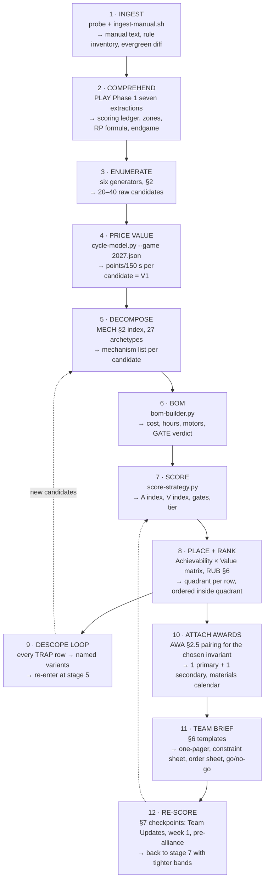

# Strategy Ranking System — manual in, ranked strategy + BOM + award plan out

**Purpose.** This is the integrating document: the one file you open at 12:00 ET on
**2027-01-09** and work top-to-bottom. Every other reference file in this repo answers one
question well; this file is the *procedure* that chains them into a single decision — which
robot this 15-student team builds, why, what it costs, what it can fall back to, and which two
awards it chases. It contains no new model. It contains the pipeline.

**Companion file:** [`strategy_ranking_system.yaml`](strategy_ranking_system.yaml) — the same
pipeline, checkpoints, template inventory and prompt registry, machine-readable.

---

## Evidence labels

| Label | Meaning |
|---|---|
| **[C]** | CONFIRMED — verified against a primary source (manual text, FIRST page, tool output on this machine) |
| **[H]** | HISTORICAL-PATTERN — derived from 2016–2026 manual/TBA data in this repo; expected to recur, not guaranteed |
| **[S]** | SPECULATION — reasoned forecast about BIOCORE; must be re-checked on kickoff day |
| **UNVERIFIED** | Asserted somewhere but not checked here; treat as unknown |

## Source shorthand

| Code | Source |
|---|---|
| `REB` | 2026 REBUILT Game Manual — `manuals/archive/frc/2026_REBUILT_GameManual.pdf` |
| `REEF` | 2025 REEFSCAPE |
| `CRES` | 2024 CRESCENDO |
| `CAP` | [`reference/02_TEAM_CAPACITY_MODEL.md`](reference/02_TEAM_CAPACITY_MODEL.md) |
| `ARCH` | [`reference/03_ARCHETYPE_CORPUS.md`](reference/03_ARCHETYPE_CORPUS.md) |
| `PF` | [`reference/04_PREDICTIVE_FACTORS.md`](reference/04_PREDICTIVE_FACTORS.md) |
| `RUB` | [`reference/ACHIEVABILITY-RUBRIC.md`](reference/ACHIEVABILITY-RUBRIC.md) |
| `AWA` | [`reference/awards/AWARD-ALIGNMENT.md`](reference/awards/AWARD-ALIGNMENT.md) |
| `MECH` | [`reference/bom/06_MECHANISM_CATALOG.md`](reference/bom/06_MECHANISM_CATALOG.md) |
| `PLAY` | [`KICKOFF_PLAYBOOK.md`](KICKOFF_PLAYBOOK.md) |
| `SCOUT` | [`reference/SCOUTING-PLAN.md`](reference/SCOUTING-PLAN.md) |
| `CHURN` | [`reference/RULE-CHURN-WATCHLIST.md`](reference/RULE-CHURN-WATCHLIST.md) · `research/teamupdate_analysis/` |
| `QAH` | [`reference/QA-AMBIGUITY-HOTSPOTS.md`](reference/QA-AMBIGUITY-HOTSPOTS.md) |

**Season facts this file assumes** `[C]`: BIOCORE presented by Haas is the **FRC** 2027 game,
FIRST CANOPY season, kickoff **2027-01-09, 12:00 ET**. The **roboRIO is replaced by Systemcore**
— the largest control-system change since the cRIO, and a tax on every programming estimate
(`ARCH` §9.4, `CAP` §5.6). BIOBUZZ is the *FTC* sibling game; **Pollen / StarterBots / Skill
Builders are FTC-only nouns and never appear in BIOCORE**. BIOCORE's scoring-element name and
specs are **not public** as of 2026-08-22 — every game-specific number below is a *slot*, not a
value. See [`research/00_PREMISE_CORRECTION.md`](research/00_PREMISE_CORRECTION.md).

---

## §0 — Kickoff-day 60-second workflow (runnable)

Paste this whole block into a shell at 12:00 ET. Steps 1–2 are the only ones that need the
internet. Everything after runs offline against files already in this repo.

```bash
# Run from the repository root. On a fresh clone, run the corpus rebuild first
# (bash tools/rebuild-corpus.sh --fetch, then bash tools/rebuild-corpus.sh; see README.md).

# ---- 1. GET THE MANUAL. The CDN container listing is disabled, so the filename is guessed
#         across every shape FIRST has used since 2022. Re-run until it returns a hit. (~10 s)
bash tools/probe-2027-manual.sh --download
M="manuals/2026-27_BIOCORE/2027GameManual.pdf"     # adjust to whatever the probe actually saved

# ---- 2. INGEST + DIFF THE EVERGREEN SPINE against 2026 REBUILT. (~60 s)
#         Output: extracted text, rule inventory, and WHICH numbered evergreen rules FIRST
#         quietly edited, deleted, or added. That diff is the highest-value 60 seconds of the day.
bash tools/ingest-manual.sh "$M" V1

# ---- 3. RE-CONFIRM THE TEAM MODEL BEFORE SCORING ANYTHING. (~2 s)
#         The line that matters is BINDING -> novel_mechanisms_max. Today it is 2.
python tools/capacity_model.py --students 15 --hours-per-week 15 --deadline week1

# ---- 4. RE-DERIVE THE RUBRIC WEIGHTS FROM THE ACTUAL BIOCORE MANUAL, not from REBUILT. (~5 s)
python tools/rubric_weights.py "$M"

# ---- 5. ARE THE AWARD NAMES STILL THE ONES AWA ASSUMES? exit 0 == yes. (~10 s)
bash reference/awards/kickoff_award_check.sh "$M"

# ---- 6. PRICE THE VALUE AXIS FROM CYCLE ARITHMETIC. First with the REBUILT worked example so
#         the team can see the shape; then with 2027.json once §1 step 4 has filled it in.
python tools/cycle-model.py --game rebuilt --sweep
python tools/cycle-model.py --game strategies/2027.json --sweep      # after you author it

# ---- 7. THE RANKED TABLE. This is the deliverable. Author strategies/candidates.yaml from the
#         §2 enumeration, then: (~3 s)
python tools/score-strategy.py --candidates strategies/candidates.yaml
python tools/score-strategy.py --candidates strategies/candidates.yaml --json > strategies/ranked.json

# ---- 8. BOM + GATE CHECK for the top-ranked row, and for its descoped fallback.
python tools/bom-builder.py strategies/primary.yaml  --markdown
python tools/bom-builder.py strategies/fallback.yaml --markdown
python tools/bom-builder.py strategies/primary.yaml  --csv strategies/order_sheet.csv

# ---- 9. THE ONLY THREE LINES YOU READ OUT LOUD TO THE TEAM:
#         a) score-strategy: the QUADRANT of the top row  (BUILD THIS / CHEAP INSURANCE / TRAP / DELETE)
#         b) score-strategy: its BINDING CONSTRAINT       (the one thing to fix)
#         c) bom-builder:    VERDICT: ALL GATES PASS      (exit 0) or FAILS n GATE(S) (exit 1)
```

**Exit-code contract** `[C]` — both scoring tools are shell-testable:

| Command | exit 0 | exit 1 | exit 2 |
|---|---|---|---|
| `bom-builder.py` | all gates pass | ≥1 gate FAILS | bad input |
| `kickoff_award_check.sh` | award names unchanged | a name changed — stop and re-read `AWA` §2.5 | — |
| `score-strategy.py` | table printed | — | bad YAML |

**If you only have five minutes**, run steps 1, 2, 3 and stop. The manual diff plus
`novel_mechanisms_max = 2` is 80% of the day's decision content.

---

## §1 — The pipeline

Nine stages. Each has one owner, one input, one artifact, and one exit test. Nothing advances
until the previous stage's artifact exists on disk.



### 1.1 The stage table

| # | Stage | Owner | Input | Artifact on disk | Exit test | Wall clock |
|---:|---|---|---|---|---|---|
| 1 | Ingest | Mentor | live CDN | `manuals/2026-27_BIOCORE/*.pdf`, `research/rule_inventories/2027*` | evergreen diff printed | 0:00–0:15 |
| 2 | Comprehend | Whole team | manual text | `PLAY` §1.2–1.10 tables filled | comprehension self-test passed without looking (`PLAY` §1.10) | 0:15–1:00 |
| 3 | Enumerate | Strategy lead | scoring ledger | `strategies/candidates.yaml` (ids + names only) | ≥6 invariants instantiated, §2.7 checklist all ticked | 1:00–2:00 |
| 4 | Price value | 2 students + mentor | scoring ledger | `strategies/2027.json` | `cycle-model.py --sweep` runs clean | 2:00–3:00 |
| 5 | Decompose | Design lead | candidates | `mechanism:` list per candidate | every mechanism maps to a `MECH` §2 id or is flagged NOVEL | 3:00–4:00 |
| 6 | BOM | Build lead | mechanism lists | `strategies/*.yaml` + `order_sheet.csv` | `bom-builder.py` exit code recorded per candidate | day 1–2 |
| 7 | Score | Strategy lead + mentor | all of the above | `strategies/ranked.json` | every candidate has A, V, tier, binding constraint | day 2 |
| 8 | Place + rank | Whole team | ranked.json | the 2×2 drawn on the whiteboard | each row has a quadrant *and a decision*, no "maybes" | day 2 |
| 9 | Descope loop | Strategy lead | TRAP rows | new candidate ids | every Q3 row has ≥1 descoped sibling scored | day 2 |
| 10 | Awards | Awards lead | chosen invariant | `awards/plan.md` | exactly 2 awards named, calendar dated | day 3 |
| 11 | Brief | Mentor | everything | `strategies/BRIEF.md` | fits on one page; a first-year can read it aloud | day 3 |
| 12 | Re-score | Strategy lead | Team Updates, results | dated `ranked_*.json` | checkpoint table §7 has no missed rows | all season |

### 1.2 The three hard numbers the pipeline enforces

These come out of `CAP` and are not negotiable inside a strategy meeting `[C]` `CAP` §5.3:

```yaml
parallel_workstreams_max: 3      # drivetrain+electrical, primary scorer, software. That is all three.
novel_mechanisms_max:     2      # beyond the drivetrain
novel_mechanisms_recommended: 1  # plus one COTS-derived or trivial second
```

Two 2027-specific deductions run **before** the workstream gate `[C]` `CAP` §5.6 / `RUB` §5:
vision-based pose estimation **or** first-year swerve adoption each drops
`novel_mechanisms_max` from 2 → **1**. Both together drop it to **0** — a plan that builds a
drivebase and nothing else. Say that out loud on kickoff day rather than discovering it in week 4.

### 1.3 What the pipeline deliberately does *not* do

- It does not rank by point ceiling. `ARCH` Rule 2: the do-everything robot is **0/5** across five
  seasons of small-team instances, and it always wins a ceiling-based ranking.
- It does not let a high VALUE score argue past a gate. A gated design is capped at **T4 GATED**
  regardless of index (`RUB` §5).
- It does not treat archetype *families* as candidates. It scores **variants** — fixed-range vs.
  turreted, one auto element vs. four, L1 climb vs. L3. `ARCH` Rule 1: invariant I1 is **0/4 at
  full spec and 6/9 restricted to the fixed-range variant**.

---

## §2 — Strategy enumeration: generating candidates so nothing is missed

The failure mode on kickoff day is not bad analysis. It is a whiteboard with six ideas on it,
all of them variations of "pick up the thing and put it in the high place," chosen because they
are the ideas a room of teenagers produces in the first twenty minutes. Enumeration is mechanical
on purpose: **run all six generators, write down everything each produces, then score.** Do not
filter while generating. Filtering is stage 7's job and it is quantitative.

Target: **20–40 raw candidates**, collapsing to **8–14 scored rows** after de-duplication.

### 2.1 Generator A — by scoring action

From the `PLAY` §1.2 scoring action ledger, for **each row** in the manual's point table:

1. A candidate that does *only* that action, at the highest rate the team can sustain.
2. A candidate that does *only* that action, at **one fixed field position** (no navigation).
3. A candidate that does that action **only in AUTO**.
4. A candidate that **denies** that action to the opponent (see generator F).

A four-row scoring table therefore generates 16 raw candidates before any combination. This is
the point: combinations are what students propose, and combinations are what `novel_mechanisms_max`
kills. Singletons are under-proposed and over-perform.

### 2.2 Generator B — by field zone

For **each named zone** in the `PLAY` §1.3 zone register, ask:

| Question | Candidate it generates |
|---|---|
| Can we score without ever leaving this zone? | Fixed-station scorer |
| Is this zone protected from defense? | Protected-zone camper — high floor, immune to the main variance source |
| Is this zone a traffic choke point? | Choke-point defender / zone-denial bot |
| Does a human player feed into this zone? | Feeder-adjacent support bot (`ARCH` I6, **5/5 small-team success**) |
| Is there a zone nobody will contest? | Uncontested-scoring specialist |

Zone geometry is the single most reliable generator of non-obvious candidates because it is
derived from the *field*, which is public on day 1, rather than from meta, which is not.

### 2.3 Generator C — by match phase

Three phases, three independent candidate families `[H]` — the split has been AUTO / TELEOP /
ENDGAME in every season in the corpus:

- **AUTO-only.** `ARCH` I5: zero mechanisms, $0–400, software only, and the highest per-second
  point density in the match in every corpus season (`REB` TOWER L1 pays **15 in AUTO vs 10 in
  TELEOP`; `CRES` SPEAKER 5 vs 2; `REEF` L4 7 vs 5) `[C]`. Success is **5/5 scoped to 1–2 elements
  and 1/5 at full-field scope.** The variant is the whole story. **Systemcore caveat**: `ARCH`
  §9.4 raises every programming-difficulty rating for 2027; an auto-heavy plan is the one most
  exposed to a control-system transition, so score A7 pessimistically until the first robot moves.
- **TELEOP-only.** The volume scorer. Score the *fixed-range* variant separately from the
  variable-range one; they are different candidates with different gates.
- **ENDGAME-only.** `ARCH` I4: **3/3 at the low/mid tier, 0/3 at the top tier.** Generate one
  candidate per endgame tier, never one candidate for "the endgame."

### 2.4 Generator D — by alliance role

You are one of three robots. Enumerate what the alliance needs that you could be:

| Role | Candidate | Corpus record |
|---|---|---|
| Primary scorer | Volume scorer, fixed variant | I1 · 6/9 restricted, 0/4 full spec |
| Second scorer | Same mechanism, lower rate, higher uptime | I1 variant |
| Feeder / support | No scoring mechanism; raises a partner's rate | **I6 · 5/5 = 100%** |
| Defender | Denies opponent scoring where legal | **I3 · 3/4** |
| Endgame anchor | Guarantees the alliance's endgame RP | I4 · 3/3 low tier |
| Insurance | Deliberately minimal, never fails | **I7 · 5/5 = 100%** |

**Read that column again.** The three highest small-team success rates in a 30-record, 5-season
corpus are feeder/support, minimal-flawless, and defense — the three archetypes no student
proposes on kickoff day. `ARCH` Rule 3: 64–78% of event-winning alliances carried a below-median-OPR
robot `[C]` TBA. Being the *right* third robot is the modal winning plan at this team size, not
the consolation prize.

### 2.5 Generator E — by ranking-point path

Once `PLAY` §1.6 has the ranking formula, generate one candidate **per RP**:

1. For each bonus RP, the cheapest robot that reliably contributes the alliance's share of it.
2. The robot that secures an RP *alone*, when the threshold divided by three is within reach.
3. The robot that maximises win probability while ignoring bonus RPs entirely.

Then settle **RP-chasing vs. win-chasing with data, not vibes** — `PLAY` §2.4 and the
`research/predictive_tba/` rankings CSVs (2023–2026) already contain the machinery. `[H]` In
`REB` the bonus thresholds escalated **3.6×** from District (100) to Championship (360) for the
same RP; an RP-optimised design can be correct at your Week-1 event and wrong at DCMP. Score both.

### 2.6 Generator F — by opponent denial

The generator nobody runs. For each opponent scoring action, ask what makes it *not* happen:

- Occupying the space it needs (legal only outside protected zones — check `PLAY` §1.3).
- Consuming the resource it needs (element control; check whether possession is capped — `REB` was
  uncapped: *"may control any amount"* `[C]`).
- Arriving first at a contested location (a speed-only, mechanism-free candidate).
- Forcing fouls — then run the `PLAY` §4.2 audit: *is the penalty cheaper than the points?*

**Legality first.** Defense candidates live or die on the protection rules and the one-defender
rule, both of which are high-churn `[H]` — see [`reference/RULE-CHURN-WATCHLIST.md`](reference/RULE-CHURN-WATCHLIST.md)
and `tools/defense_rule_trend.py`. A defense strategy that is legal in the V1 manual and illegal
after Team Update 3 is a season-ending surprise unless §7 catches it.

### 2.7 The anti-blind-spot checklist

Before stage 3 closes, every one of these must have a written candidate — **or a one-line written
reason it is impossible in BIOCORE**. "Nobody wanted to" is not a reason.

- [ ] A candidate with **zero** scoring mechanisms (pure defense) — `ARCH` I3
- [ ] A candidate that never leaves one field zone
- [ ] A candidate that only acts in AUTO — `ARCH` I5
- [ ] A candidate that only acts in the last 30 seconds — `ARCH` I4 low tier
- [ ] A candidate that raises a *partner's* score, not its own — `ARCH` I6
- [ ] A candidate that is deliberately the simplest legal scoring robot — `ARCH` I7
- [ ] A candidate that is the KOP chassis plus exactly one COTS-derived mechanism — `MECH` §12.1 `simple.yaml`, **exit 0**
- [ ] The **do-everything** robot, written down **explicitly so it can be rejected on the record** — `ARCH` I2, **0/5**
- [ ] A descoped variant of every candidate that lands in Q3 TRAP
- [ ] For each of the above: is it still legal under the *evergreen* rules the stage-1 diff flagged as edited?

### 2.8 De-duplication rule

Two candidates are the **same row** only if they share (a) the mechanism list, (b) the field zone,
and (c) the match phase. Differing in any one of those makes them separate rows, because each
changes at least one achievability factor. When in doubt, keep both — scoring is cheap, and a
merged row hides exactly the variant `ARCH` Rule 1 says is the one that works.

---

## §3 — Scoring under uncertainty

On 2027-01-09 most inputs are unknown. The rubric still runs. What changes is not the method but
the **confidence band** attached to each number, and the discipline of re-scoring on a schedule
instead of when someone feels uneasy.

### 3.1 What is knowable when

| Input | Known at | Confidence on day 1 |
|---|---|---|
| Scoring table, point values | 12:00 ET day 1 `[C]` | **HIGH** — read it off the manual |
| Field zones, protection rules | day 1 `[C]` | **HIGH** |
| RP thresholds | day 1 `[C]` | **HIGH** (values), **LOW** (whether they are achievable) |
| Scoring-element specs | day 1 `[C]` | HIGH once published; **currently not public** `[S]` |
| Your cycle time | week 4–6 | **LOW** — the single largest error source in V1 |
| Defense legality in practice | after Q&A + TU2–4 | **LOW** `[H]` `QAH` |
| Realistic match scores | week 1 events | **LOW** |
| Systemcore stability | week 2–5 | **LOW** `[S]` — no precedent in this repo |
| Alliance-selection meta | week 4+ | **LOW** |
| COTS availability | day 1, decaying | **MEDIUM** — popular parts stock out inside 14 days `[H]` |

### 3.2 The band protocol

Score every factor as **`best / likely / worst`**, not as a point value. Run the rubric three times.

```yaml
# strategies/candidates.yaml — band form
candidates:
- id: S1
  name: Fixed-position volume scorer (single tier)
  achievability: {A1: 3, A2: 3, A3: 4, A4: 3, A5: 4, A6: 5, A7: 3,
                  A8: 5, A9: 4, A10: 4, A11: 4, A12: 3, A13: 4}
  bands:                       # informal: keep beside the row, re-run with substitutions
    A7: {best: 4, likely: 3, worst: 1}     # Systemcore transition tax
    A11: {best: 5, likely: 4, worst: 2}    # iteration count if fabrication queues
  value: {V1: 4, V2: 4, V3: 4, V4: 1, V5: 4}
  gates_input: {mfg_floor: bandsaw+drill, new_workstreams: 1, novel_mechanisms: 1,
                marginal_cost_high_usd: 1100, mechanism_hours: 174,
                mentor_minutes_per_week: 80}
  cycle_model: {game: rebuilt, cycle: 9, auto_scored: 3,
                endgame: "TOWER L3 (TELEOP)", median_alliance_score: 147}
```

**The decision rule is about the band, not the midpoint:**

| Band behaviour | Decision |
|---|---|
| All three runs land in the **same quadrant** | Decide now. Uncertainty is not what is stopping you. |
| Runs straddle **Q1 ↔ Q2** (value uncertain, achievability solid) | Build it. Q2 is still worth building; you are arguing about ordering, not existence. |
| Runs straddle **Q1 ↔ Q3** (achievability uncertain) | **Do not commit.** Buy information first (§3.4), or commit to the descoped variant, which by construction does not straddle. |
| Worst case fires a **hard gate** | Treat it as gated *today*. Gates are statements about capability, and capability does not improve because you are optimistic. |

### 3.3 Which factors dominate the uncertainty

Weighted deficit is what moves the index, so uncertainty in a high-weight factor matters far more
`[C]` `RUB` §2/§8:

| Factor | Weight | Day-1 confidence | Why it dominates |
|---|---:|---|---|
| A4 drive_practice_sensitivity | **90** | MEDIUM | Highest weight in the corpus; `PF` measures drive practice at 90 and `CAP` §3.4 shows the baseline plan does *not* adequately fund it |
| A5 reliability_exposure | 88 | LOW | You cannot know it until the mechanism exists |
| A1 build_hours_fit | 85 | MEDIUM | Depends on event week — a choice you control (`CAP` §7.4: Week 1 → Week 3–4 buys **+255 effective hours, free**) |
| A2 parallel_workstream_demand | 85 | HIGH | Countable from the mechanism list on day 1 |
| A7 programming_complexity | 70 | **LOW in 2027** | Systemcore. No precedent. Score the *worst* band until proven otherwise |
| V1 points-per-150 s | — | LOW | Imported from `cycle-model.py`; entirely hostage to cycle-time assumption |

**The practical consequence.** A2 and A12 are countable on day 1 and high-weight-ish; A5 and A7
are not knowable and are heavily weighted. So the day-1 ranking should be driven by the countable
factors, and the unknowable ones should be scored **pessimistically** — which systematically
favours simple designs. That bias is not an artifact. It is the corpus result (`ARCH` Rules 1–4)
encoded into the procedure.

### 3.4 Buying information instead of guessing

Ranked by information gained per hour spent:

| Action | Cost | Resolves |
|---|---|---|
| File Q&A questions in the first 48 h (`PLAY` §4.3) | 2 h | Rule ambiguity — highest-leverage 48 hours of the season `[C]` `PLAY` |
| Prototype the *riskiest* mechanism in cardboard/wood, day 2–4 | 8 h | A5, A11, and most of V1 |
| Time a real human doing the cycle by hand on a taped field | 3 h | V1 cycle-time assumption directly |
| Order the long-lead COTS part before deciding | $ only | A10, A13 — availability decays `[H]` |
| Watch week-1 webcasts (`PLAY` §2.5) | 6 h | Realistic scores, defense meta, RP achievability |
| Get one more technical mentor | recruiting, deadline **2026-11-17** | G5 mentor gate: 204 → 408 min/wk `[C]` `RUB` §5 |

**Prototype rule.** If two candidates straddle Q1↔Q3, the prototype that separates them is worth
more than any amount of further scoring. Build it in the cheapest possible material, before CAD
freeze on day 10.

---

## §4 — Reading the matrix

```
            +----------------------------------+----------------------------------+
            |            VALUE < 55            |            VALUE >= 55           |
            +----------------------------------+----------------------------------+
ACH >= 60   |      Q2 · CHEAP INSURANCE        |         Q1 · BUILD THIS          |
            +----------------------------------+----------------------------------+
ACH <  60   |          Q4 · DELETE             |           Q3 · TRAP              |
            +----------------------------------+----------------------------------+
```

Thresholds and quadrant semantics are `RUB` §6 `[C]`. What this section adds is **how many rows
you are allowed to act on with 15 students.**

### 4.1 Decision rule per quadrant, in one line each

| Quadrant | Rule | The mistake it prevents |
|---|---|---|
| **Q1 BUILD THIS** (A≥60, V≥55) | Commit on kickoff weekend. Unsupervised lead by **day 3**, CAD freeze by **day 10**. Multiple Q1 rows → build the one with the smaller A1 deficit; hold the other only if `novel_mechanisms_max` still has room. | Endless comparison of two good options |
| **Q2 CHEAP INSURANCE** (A≥60, V<55) | Do not lead with it; do not skip it. This is the **second mechanism / the fallback / the thing that keeps you a legal useful partner** when the primary is in pieces. Build after the Q1 design passes its first reliability test, from spare hours, first-year pair leading. | Treating the simple thing as beneath the team |
| **Q3 TRAP** (A<60, V≥55) | Never "work harder." **Enumerate descoped variants and re-score each as its own candidate.** In the 30-record back-test, **10 of 30** archetypes land here and *every one is gated*. | The season-killer: picking the exciting impossible thing |
| **Q4 DELETE** (A<60, V<55) | Say it out loud in the meeting and cross it off. No "maybes." A live maybe consumes the scarcest resource in the model — **mentor decision attention, 204 min/wk** — every week it survives. | Zombie ideas |

`[C]` `RUB` §9: in the 30-archetype back-test Q4 is empty, because `ARCH` is a corpus of things
that worked somewhere. **Your kickoff whiteboard will populate Q4.** That is the whiteboard's job.

### 4.2 How many strategies to actually pursue

With 15 students and `parallel_workstreams_max = 3` — of which **all three are already spoken
for** by drivetrain+electrical, the primary scorer, and software `[C]` `CAP` §5.3 — the honest
answer is one primary plus a fallback that shares its mechanisms.

| Slot | Count | What it is | Where it comes from | Workstream cost |
|---|---:|---|---|---|
| **PRIMARY** | 1 | The robot you are building | Highest-index **Q1** row | Workstream #2 (already budgeted) |
| **FALLBACK** | 1 | The descoped variant of PRIMARY, sharing its mechanism | Q2, or the descoped sibling of PRIMARY | **0** — it is a *scope* decision, not a new stream |
| **INSURANCE** | 1 | Deliberately-minimal flawless behaviour the robot always has | Q2, `ARCH` I7 | 0 if it is a *behaviour*; 1 if it is a *mechanism* — then it is over the line |
| **STRATEGIC ROLE** | 1 | Defense / feeder / support you can *play* with the robot you built | `ARCH` I3/I6, drive-practice cost only | 0 mechanisms, real practice hours |
| **REJECTED (on the record)** | 3–6 | Written down with the reason | Q3 and Q4 rows | 0 |

**The fallback must share the primary's mechanism.** A fallback with its own mechanism is
workstream #4, and workstream #4 does not fail loudly — it fails by starving the primary
mechanism of the last 30% of its reliability work, which `PF` §8 prices at roughly **halving your
probability of being picked** `[C]` `CAP` §5.3.

**More students does not change this** `[C]` `CAP` §5.5: at 20 students the binding constraint is
still **2.0** novel mechanisms. Five more students buys hours *inside* the mechanisms you already
have — which is where reliability lives — not a wider robot. Only machine capacity and outsourced
fabrication widen the robot, and both are bought with money.

### 4.3 Tie-breaks inside a quadrant

When two rows sit in the same quadrant, in order:

1. Fewer **novel mechanisms** wins (`ARCH` Rule 2 — cost is multiplicative, not additive).
2. Lower **A4 deficit** wins (drive practice, weight 90 — the highest-leverage factor).
3. Better **graceful degradation** (A6) wins — the row that still scores something when one
   subsystem fails.
4. Lower **manufacturing floor** wins (`RUB` gate G1: hand / bandsaw+drill / 3D print pass; router
   passes only with an outsourced account, ≤2 parts, ≥2 weeks' lead).
5. Shorter **critical path** (A13) wins.

Do **not** tie-break on point ceiling. That is the ranking the whole system exists to replace.

### 4.4 The three lines to write on the whiteboard

```
PRIMARY:   <id> <name>        quadrant <Qn>  tier <Tn>  binding: <constraint>
FALLBACK:  <id> <name>        (descope of PRIMARY: <what is removed>)
REJECTED:  <id> ... because <gate or quadrant>, decided <date>
```

---

## §5 — Award attachment and the materials calendar

Two awards. Not one, not three. `[C]` `AWA` §0: the Judging Manual rule is *"Do not award the
same team more than 1 judged award at a single event"* — so **two prepared lanes is the efficient
frontier; a third buys overlap, not probability.** Every machine award is worth identical District
points `[C]` `REB` Table 11-1, so chase the one you can *win*, not the one that sounds best.

### 5.1 The pairing, keyed to the invariant your PRIMARY instantiates

`[C]` `AWA` §2.5 — 2026 exact award names. Confirm with `bash reference/awards/kickoff_award_check.sh` before use.

| Invariant your PRIMARY matches | **PRIMARY award** | **SECONDARY award** |
|---|---|---|
| **I1** Reliable high-volume single-task scorer | Quality Award | Creativity Award sponsored by Rockwell Automation |
| **I2** Do-everything ⚠ *do not build for this* | Creativity Award sponsored by Rockwell Automation | Industrial Design Award |
| **I3** Defense specialist | Judges Award | Gracious Professionalism Award |
| **I4** Endgame specialist | Excellence in Engineering Award sponsored by Littelfuse | Creativity Award sponsored by Rockwell Automation |
| **I5** AUTO specialist | Innovation in Control Award sponsored by nVent | Autonomous Award sponsored by Google.org |
| **I6** Feeder / support robot | Gracious Professionalism Award | Creativity Award sponsored by Rockwell Automation |
| **I7** Deliberately-minimal flawless robot | Quality Award | Excellence in Engineering Award sponsored by Littelfuse |

Only eight distinct awards appear across fourteen slots, and the materials library is shared
(`AWA` §3.9) — so **committing to a pairing on kickoff weekend costs almost nothing in
optionality**. Do it on day 3, not in week 5.

### 5.2 The hours reality

`[C]` `AWA` §0: the awards / business / media / scouting line is **44.9 h — 7.5% of the plan** at a
Week-1 event, and **slack in the whole plan is +0.0 h** (`CAP` §3.3). There is no reserve. So:

- Award work is **scheduled**, never "when we get to it."
- Every artifact must serve **at least two** of: the pitch, the submission, and the build binder
  (`AWA` §3.9 shared artifact library).
- The single cheapest award-driven design nudge beats three hours of writing — see `AWA` §4.1's
  top five, ranked by hours-to-odds ratio.

### 5.3 Materials calendar, counted from kickoff (2027-01-09)

Dates are kickoff-relative and therefore `[C]`; the event-week rows are `[S]` until you register.

| When | Day | Deliverable | Owner | Serves |
|---|---:|---|---|---|
| Kickoff weekend | D+0–2 | Pairing chosen and written into `awards/plan.md` | Awards lead | both lanes |
| Day 3 | D+3 | Design-process log **started** (dated entries, photos) | Every subteam | Quality, Excellence in Engineering |
| Day 10 | D+10 | CAD freeze screenshots + the "why we rejected X" page | Design lead | Creativity, Industrial Design |
| Week 3 | D+21 | Reliability test log opened (attempt/success counts per mechanism) | Build lead | **Quality** — this *is* the thesis |
| Week 4 | D+28 | 5-minute pitch outline drafted (`AWA` §3.10, one template, four swappable middles) | Awards lead | both lanes |
| Week 5 | D+35 | Judge-question prep bank rehearsed (`AWA` §3.11) | Whole team | both lanes |
| Week 5 | D+35 | Any written submission drafted (check the submission deadline in the manual's awards section — it is usually **before** your event) | Awards lead | submitted awards |
| Event −7 d | — | Pit display, one-page robot sheet, binder printed | Awards lead | both lanes |
| Event −1 d | — | Two students can each give the pitch cold | Mentor | both lanes |

**The accessibility check is measured, not asserted** `[C]` `AWA` §1.4 — run it on the actual
materials, not on the intention.

### 5.4 Award anti-patterns

- **Chasing an award the robot does not support** (`AWA` §5.1). If your PRIMARY is I7 and you
  submit for Creativity, you are competing against I2 robots on their own ground.
- **Retrofitting a story** (`AWA` §5.2). Judges detect this; the design log written from day 3 is
  the only defence, and it costs ten minutes a day.
- **Chasing a third award.** See the one-award-per-team rule above.

---

## §6 — Team-facing outputs

Six templates. Copy the block, fill the angle brackets, delete nothing. These are what actually
leave this repo and reach students.

### 6.1 One-page strategy brief — `strategies/BRIEF.md`

```markdown
# BIOCORE — What We Are Building
Decided <YYYY-MM-DD> · Revision <n> · Next re-score: <checkpoint from §7>

## In one sentence
We are building a <archetype, e.g. "fixed-position single-tier volume scorer"> that
<one scoring action> from <one field zone>, plus <the one trivial second thing>.

## Why this one
| | |
|---|---|
| Quadrant | <Q1 BUILD THIS> |
| Tier | <T1 GREEN> |
| Achievability index | <A> |
| Value index | <V> |
| Binding constraint | <the single thing to fix> |
| Novel mechanisms | <n> of 2 allowed |
| Workstreams | <n> of 3 |
| Marginal cost | $<x> of $2,500 cap |
| Mechanism hours | <h> of 205 h pool |

## What we are NOT building, and why
| Rejected | Quadrant/Gate | Reason in one line |
|---|---|---|
| <id> | Q3 TRAP | <the gate that fired> |
| <id> | Q4 DELETE | <low value AND out of reach> |
| Do-everything robot | Q3/gated | 0 of 5 small-team instances have ever worked (ARCH I2) |

## If it goes wrong
FALLBACK: <descope of the primary — what gets removed, and by what date we decide>
DECIDE BY: <date> (see §7 checkpoint)

## Awards
PRIMARY: <award> · SECONDARY: <award> · Materials calendar starts day 3.

## The three numbers we protect
1. Drive practice hours: <target> — highest-weighted success factor in the corpus
2. Reliability test attempts per mechanism: <target>
3. Weeks of margin before our event: <n>
```

### 6.2 Ranked strategy table — `strategies/RANKED.md`

Generated by `score-strategy.py`; this is the human-readable shape.

```markdown
| Rank | ID | Strategy | A | V | Quadrant | Tier | Gates | Binding constraint | Decision |
|---:|---|---|---:|---:|---|---|---|---|---|
| 1 | S3 | <name> | 71 | 62 | Q1 BUILD THIS | T1 GREEN | — | A4 drive practice | **PRIMARY** |
| 2 | S1 | <name> | 68 | 44 | Q2 CHEAP INSURANCE | T1 GREEN | — | A11 iteration | **FALLBACK** |
| 3 | S7 | <name> | 55 | 71 | Q3 TRAP | T4 GATED | G2 workstreams | G2: 3 novel > 2 | descope → S7b |
| 4 | S7b | <name> descoped | 64 | 58 | Q1 BUILD THIS | T2 STRETCH | — | A1 build hours | hold; needs Week 3–4 event |
| 5 | S9 | <name> | 41 | 38 | Q4 DELETE | T3 RED | G1 machine | G1: needs CNC | **rejected <date>** |
```

Rules: rank **inside** quadrant, never across. Every row has a Decision. No blank Decision cells.

### 6.3 Design-constraint sheet — `strategies/CONSTRAINTS.md`

The sheet each subteam pins to the wall. Extracted from the manual (`PLAY` §3.2) plus the model.

```markdown
# Design Constraints — do not violate without a written exception
Source: BIOCORE manual <version/TU>, ingested <date>

## From the manual  [C]
| Constraint | Value | Manual rule | Checked by |
|---|---|---|---|
| Starting volume | <x> | R<nnn> | <name> |
| Max extension | <x> | R<nnn> | <name> |
| Weight limit | <x> | R<nnn> | <name> |
| Bumper spec | <x> | R<nnn> | <name> |
| Motor/controller allowances (Systemcore era) | <x> | R<nnn> | <name> |
| Scoring element interface | <spec> | §<n> | <name> |
| Height needed to score | <x> | §<n> | <name> |
| Possession cap | <capped / uncapped> | §<n> | <name> |

## From the team model  [C] CAP/RUB
| Constraint | Limit | Current |
|---|---|---|
| Novel mechanisms | 2 (1 if vision OR first-year swerve; 0 if both) | <n> |
| Parallel workstreams | 3 | <n> |
| Marginal cost | $2,500 | $<x> |
| Mechanism hours | 205 h | <h> |
| Mentor unblock demand | 204 min/wk | <m> |
| Manufacturing floor | hand / bandsaw+drill / 3D print | <floor> |

## Rules on the churn watchlist — re-check after every Team Update
<list from reference/RULE-CHURN-WATCHLIST.md that touches OUR design>
```

### 6.4 BOM / order sheet — `strategies/order_sheet.csv`

```bash
python tools/bom-builder.py strategies/primary.yaml --csv strategies/order_sheet.csv
python tools/bom-builder.py strategies/primary.yaml --markdown >> strategies/BRIEF.md
```

```markdown
| Order by | Part | Vendor | P/N | Qty | Unit | Ext | Verified? | Mechanism | Lead time | Blocker if late? |
|---|---|---|---|---:|---:|---:|---|---|---|---|
| <date> | <part> | <vendor> | <pn> | 1 | $<x> | $<x> | **verify live before ordering** | <mech id> | <d> | Y/N |
```

**Price rule** `[C]` `MECH` §0 step 7: **re-verify every price against the live vendor page before
any money moves.** Anything not verified today is **UNVERIFIED**, not an estimate. Never promote
an estimate into a unit-price field (`MECH` §13.1 V4 checks this).

**Order-by rule.** `bom-builder.py` prints an order-by schedule counted back from kickoff. The
long-lead item on the critical path (A13) gets ordered **before** the design is frozen if the part
is common to both PRIMARY and FALLBACK. That is cheap insurance, not indecision.

### 6.5 Award materials checklist — `awards/CHECKLIST.md`

```markdown
# Award Materials — <PRIMARY award> + <SECONDARY award>
Chosen <date> from AWA §2.5 for invariant <I_n>. Names verified by kickoff_award_check.sh: <exit code>

| # | Artifact | Serves lane(s) | Owner | Due (kickoff-relative) | Done |
|---:|---|---|---|---|:--:|
| 1 | Dated design log, photos + decisions | both | all subteams | D+3, then daily | ☐ |
| 2 | Rejected-alternatives page | Creativity / Industrial Design | design lead | D+10 | ☐ |
| 3 | Reliability test log (attempts/successes) | **Quality** | build lead | D+21 | ☐ |
| 4 | 5-minute pitch outline (AWA §3.10) | both | awards lead | D+28 | ☐ |
| 5 | Judge-question prep bank (AWA §3.11) | both | whole team | D+35 | ☐ |
| 6 | Written submission draft (deadline is usually pre-event) | submitted awards | awards lead | D+35 | ☐ |
| 7 | Pit display + one-page robot sheet | both | awards lead | event −7 d | ☐ |
| 8 | Accessibility check, measured (AWA §1.4) | both | awards lead | event −7 d | ☐ |
| 9 | Two students can pitch cold | both | mentor | event −1 d | ☐ |

Per-award detail: AWA §3.1–3.8. Do NOT open a third lane.
```

### 6.6 Go/no-go memo — `strategies/GONOGO_<date>.md`

Run at each §7 checkpoint. One page, signed by the mentor, filed with a date.

```markdown
# Go / No-Go — <checkpoint name>, <date>

## What changed since last score
- Manual/TU: <output of teamupdate-diff.py season 2027 --watch>
- Results/meta: <what week-1 webcasts or our own matches showed>
- Team: <hours actually worked vs. planned; who left; what broke>

## Re-score delta
| ID | A before → after | V before → after | Quadrant before → after | Tier |
|---|---|---|---|---|
| PRIMARY <id> | <a> → <a'> | <v> → <v'> | <q> → <q'> | <t> |
| FALLBACK <id> | | | | |

## The gate check
`python tools/bom-builder.py strategies/primary.yaml` → exit <0/1>; gates fired: <none / list>

## Decision  (tick exactly one)
- [ ] **GO** — continue as planned. Next checkpoint: <date>
- [ ] **DESCOPE** — drop <named scope>. New target date: <date>. Who is told: <list>
- [ ] **FALL BACK** — switch to FALLBACK. Trigger that fired: <named trigger>
- [ ] **STOP + RE-RANK** — a rule change invalidated the ranking. Re-run §0 steps 4–8.

## Why, in two sentences
<...>

Mentor: <name>   Strategy lead: <name>
```

---

## §7 — Re-scoring checkpoints through the 2027 season

A ranking produced on day 1 from LOW-confidence inputs is a hypothesis. These are the dated
opportunities to falsify it. **Missing a checkpoint is the failure mode**, not being wrong at one.

### 7.1 The checkpoint table

Kickoff = 2027-01-09 `[C]`. Calendar dates for event weeks are `[S]` until registration; the
kickoff-relative offsets are exact.

| # | Checkpoint | When | Trigger | What to re-run | What can change |
|---:|---|---|---|---|---|
| **C0** | Initial rank | D+0 to D+2 | kickoff | `python tools/score-priors.py priors` **first**, then full §0 with `cycle-model.py --range` | everything. There is **no 2027 outcome data** on this date — every scoring number is a PRIOR from 2023–26 and must be published as a band, never a point estimate |
| **C1** | First Q&A answers | D+3 to D+7 | Q&A system opens | `qa-rule-heat.py`; re-read `QAH` | legality of denial/defense candidates; a gate can appear |
| **C2** | **Team Update sweep** | every TU, D+3 onward `[H]` | new TU posted | `python tools/teamupdate-diff.py season 2027 --watch` | rule text, point values, penalties — see below |
| **C3** | CAD freeze | **D+10** | calendar | `bom-builder.py` on the frozen design | gates G1/G3/G4 with real part counts |
| **C4** | First mechanism moves | ~D+21 | prototype works | A5, A7, A11 bands collapse; re-run `score-strategy.py` | Systemcore reality replaces the pessimistic A7 band |
| **C5** | Bag/stop-build equivalent, or 2 weeks pre-event | ~D+35 | calendar | full re-score + **GO/NO-GO memo** | FALLBACK trigger |
| **C6** | **Week-1 results — THE PRIOR-TO-MEASUREMENT SWITCH** | first competition weekend `[S]` ≈ D+42 | webcasts/TBA | **(1)** add 2027 to `SEASONS`/`AUTO_COL`/`END_COL` in `tools/score-priors.py`; **(2)** `score-priors.py distributions 2027`; **(3)** `score-priors.py endgame-check 2027`; **(4)** `cycle-model.py` with *observed* constants and **without** `--range`; **(5)** re-run `score-strategy.py`; `PLAY` §2.5 | V1 and every RP-path candidate — this is the biggest single correction of the season. **This is where kickoff PRIORS are replaced by 2027 MEASUREMENTS.** The 2026 rehearsal was graded **D** for never doing this: it shipped a guessed median alliance score of 120 against a real 147, and made an endgame worth **1.1 %** of match score its only BUILD THIS row (`endgame-check 2026` → r = 0.003). Do not enter alliance selection (C8) on priors |
| **C7** | Our own event, after quals day 1 | event day 1 | matches played | `scouting-plan.py picklist`; re-check RP achievability | tactical role for day 2, not design |
| **C8** | **Before alliance selection** | event day 2, ~1 h before | calendar | `SCOUT` §5 pick list | who you want / how you sell yourself — not the robot |
| **C9** | Between events | +2 weeks `[S]` | calendar | full re-score with real data | FALLBACK becomes cheap here; hours are real |
| **C10** | Pre-DCMP / Champs | ~D+70+ `[S]` | qualification | re-run RP thresholds — they **escalate** at DCMP/Champs `[C]` `REB` (100 → 240 → 360, 3.6×) | an RP-optimised design can flip from correct to wrong |

### 7.2 C2 in detail — the Team Update discipline

`[C]` This repo already quantifies Team Update churn: `research/teamupdate_analysis/2026_tu_churn.tsv`
and `slot_churn_allseasons.tsv`, summarised in [`reference/RULE-CHURN-WATCHLIST.md`](reference/RULE-CHURN-WATCHLIST.md).

```bash
# Standing command. Run it the morning after every Team Update. It prints ONLY what is new
# since the last run (state lives in .watch_state.json), so it stays a 30-second job all season.
python tools/teamupdate-diff.py season 2027 --watch

# When something fires, re-ingest the manual under the TU label and diff the full text:
bash tools/ingest-manual.sh manuals/2026-27_BIOCORE/2027GameManual.pdf TU03
```

**Escalation rule.** Classify each change:

| Class | Example | Action |
|---|---|---|
| **Cosmetic** | typo, figure renumber | log it, move on |
| **Constraint** | dimension, weight, motor allowance changes | update `CONSTRAINTS.md`, re-run `bom-builder.py` |
| **Scoring** | point value or RP threshold changes | re-run `cycle-model.py` → new V1 → re-run `score-strategy.py` |
| **Legality** | defense/protection/possession rule changes | **stop.** Re-score every denial candidate; a whole quadrant can move |

The fourth class is why defense candidates carry a standing watch: protection rules and the
one-defender rule are among the highest-churn slots in the corpus `[H]` (`tools/defense_rule_trend.py`).

### 7.3 The fallback triggers, written down in advance

Decide these on kickoff weekend, while nobody is emotionally invested. Each is a *date + a
measurable condition*; when it fires, you execute — you do not re-open the debate.

| Trigger | Condition | Fires at | Action |
|---|---|---|---|
| T1 | Primary mechanism has not moved under power | **D+24** | Descope to FALLBACK scope |
| T2 | Mechanism reliability < 80% over 20 attempts | D+35 | Descope one tier; protect drive practice |
| T3 | Drive practice hours < 20 by two weeks pre-event | D+28 | Freeze all mechanism work; drive `[C]` `RUB` gate G6 |
| T4 | Systemcore stack not controlling the drivetrain | **D+17** | Cut every software-dependent scope item; A7 worst band is real |
| T5 | A hard gate fires at C3 CAD freeze | D+10 | Design as specified cannot be built — descope, do not argue with the gate |
| T6 | Any TU makes the primary strategy illegal | any | Stop; re-run §0 steps 4–8 the same day |

---

## §8 — Ready-to-paste prompts

Verbatim blocks, one per pipeline stage. Paste into a fresh session with this repo as the working
directory. Each names its inputs, its output file, and its stop condition, so the session cannot
wander into research instead of producing the artifact.

### 8.1 Stage 1–2 · Ingest and comprehend

```text
Working directory: the repository root

The BIOCORE (FRC 2027) game manual is at <PATH>. BIOCORE is FRC; BIOBUZZ is the FTC
sibling game — never import FTC nouns (Pollen, StarterBots, Skill Builders) into this analysis.
2027 replaces the roboRIO with Systemcore.

1. Run: bash tools/ingest-manual.sh <PATH> V1
2. From the ingested text ONLY (quote rule numbers and page/section for every claim), fill in the
   seven extractions of KICKOFF_PLAYBOOK.md Phase 0.2 and the Phase 1 tables:
   scoring action ledger (1.2), zone register (1.3), field element register (1.4),
   scoring element spec (1.5), ranking formula (1.6), endgame (1.7), penalty structure (1.9).
3. Report the evergreen-rule diff against 2026 REBUILT separately: which numbered rules were
   EDITED, DELETED, ADDED.
4. Mark anything you could not find in the text as UNVERIFIED. Do not infer point values.

Write to: strategies/COMPREHENSION.md. Stop when that file exists. Do not propose strategies.
```

### 8.2 Stage 3 · Enumerate candidates

```text
Working directory: the repository root
Read strategies/COMPREHENSION.md and STRATEGY-RANKING-SYSTEM.md §2.

Generate candidate strategies by running ALL SIX generators mechanically. Do not filter, do not
rank, do not judge feasibility yet:
  A by scoring action (4 variants per scoring-table row: only / fixed-position / auto-only / deny)
  B by field zone (one pass per named zone)
  C by match phase (auto-only, teleop-only, endgame-only — one per endgame tier, not one for "endgame")
  D by alliance role (primary, second scorer, feeder/support, defender, endgame anchor, insurance)
  E by ranking-point path (one per RP + the ignore-RPs candidate)
  F by opponent denial (space, resource, tempo, foul-forcing — check protection-rule legality)

Then tick every box in §2.7 or write one line explaining why that candidate is impossible in
BIOCORE. Include the do-everything robot explicitly so it can be rejected on the record.

Output strategies/candidates.yaml with id, name, generator, one-line description, mechanism
sketch. Target 20-40 raw rows. Stop there — no scoring.
```

### 8.3 Stage 4 · Price the value axis

```text
Working directory: the repository root

Author strategies/2027.json in the cycle-model.py schema (see the docstring at the top of
tools/cycle-model.py) using ONLY point values quoted from strategies/COMPREHENSION.md:
  auto_s / teleop_s / endgame_s from the manual's match-phase table
  cycle_actions: repeatable scoring actions with points_auto, points_teleop, per_cycle
  fixed_actions: endgame and one-shot actions with points, time_s, phase
  rp: each ranking point with its metric and threshold (note DCMP/Champs escalation if present)

Then run:
  python tools/cycle-model.py --game strategies/2027.json
  python tools/cycle-model.py --game strategies/2027.json --sweep

Report the cycle-time sensitivity table and state, in one sentence, at what cycle time each
fixed action stops being worth its forgone cycles. Cite the manual section for every number.
Do not adjust any number to make a strategy look better.
```

### 8.4 Stage 5–6 · Decompose and BOM

```text
Working directory: the repository root
Read reference/bom/06_MECHANISM_CATALOG.md §2 (the 27-archetype index) and §11 (the gate model).

For the top 5 candidates in strategies/candidates.yaml:
1. Decompose each into mechanisms, mapping every one to a catalog id. Anything with no catalog
   match is flagged NOVEL and counts against novel_mechanisms_max = 2.
2. Write strategies/<id>.yaml in the bom-builder input shape (see reference/bom/examples/simple.yaml).
3. Run: python tools/bom-builder.py strategies/<id>.yaml --markdown
4. Record the exit code and the VERDICT line for each. exit 1 means it FAILS gates — name them.
5. For every failing candidate, propose the single cheapest descope that clears the first gate,
   and write it as a NEW candidate id, not as an edit to the old one.

Never invent a part number, price, or vendor URL. Anything not in the catalog is UNVERIFIED.
Output: strategies/*.yaml + a summary table of id, mechanisms, cost, hours, exit code, first gate.
```

### 8.5 Stage 7–8 · Score, place, rank

```text
Working directory: the repository root
Read reference/ACHIEVABILITY-RUBRIC.md in full before scoring anything.

Score every candidate in strategies/candidates.yaml on all 13 achievability factors and 5 value
factors, using the anchors in RUB §2 and §4 — quote the anchor text you matched for each factor.
Let V1 come from cycle-model.py via the cycle_model: block; do not hand-score V1.
Score UNKNOWN factors at their WORST plausible band, especially A7 (Systemcore, no precedent).

Run:
  python tools/score-strategy.py --candidates strategies/candidates.yaml
  python tools/score-strategy.py --candidates strategies/candidates.yaml --json > strategies/ranked.json

Then produce strategies/RANKED.md in the §6.2 shape. Rules:
  - rank INSIDE quadrant, never across quadrants
  - every row gets a Decision cell; no blanks, no "maybe"
  - a gated row is T4 GATED regardless of index; do not use the index to argue past a gate
  - every Q3 TRAP row must have at least one descoped sibling scored as its own row

Finish with the three whiteboard lines from §4.4: PRIMARY, FALLBACK, REJECTED.
```

### 8.6 Stage 9 · Descope a trap

```text
Working directory: the repository root

Candidate <ID> landed in Q3 TRAP (high value, out of reach). Do NOT argue with the gate and do
NOT propose working more hours.

Enumerate every descoped variant along these axes, one variant per axis and then the combinations
that stay inside novel_mechanisms_max:
  - fixed position instead of variable/turreted   (ARCH Rule 1: I1 is 0/4 at full spec, 6/9 restricted)
  - one scoring tier instead of all tiers
  - one or two AUTO elements instead of full-field auto   (ARCH I5: 5/5 scoped, 1/5 full)
  - the lowest endgame tier instead of the top             (ARCH I4: 3/3 low, 0/3 top)
  - passive/COTS mechanism instead of actuated/fabricated
  - no vision; odometry or driver-in-the-loop instead      (CAP §5.6 deduction)
  - a behaviour the driver performs instead of a mechanism the robot has

Score EACH as a new candidate id (<ID>b, <ID>c, ...). Report which variants cross into Q1 or Q2
and what specifically was given up. If none do, say so plainly and recommend rejecting the family.
```

### 8.7 Stage 10 · Attach awards

```text
Working directory: the repository root
Read reference/awards/AWARD-ALIGNMENT.md §2.5 and §3.

First run: bash reference/awards/kickoff_award_check.sh <MANUAL PATH>
If any award name changed, stop and report the change before doing anything else.

Our PRIMARY strategy instantiates archetype invariant <I_n>. Using the §2.5 pairing table:
1. Name exactly ONE primary and ONE secondary award. Two, because the Judging Manual allows only
   one judged award per team per event — a third lane buys overlap, not probability.
2. Pull the matching checklists from AWA §3.1-3.8 and merge them into awards/CHECKLIST.md in the
   §6.5 shape, deduplicating shared artifacts (AWA §3.9).
3. Date every row against the §5.3 materials calendar, kickoff = 2027-01-09.
4. Flag any artifact that serves only ONE lane — with 44.9 h total and zero slack, single-purpose
   artifacts are the first thing cut.

Use exact 2026 award names. Never invent or shorten an award name.
```

### 8.8 Stage 12 · Checkpoint re-score

```text
Working directory: the repository root
This is checkpoint <C_n> from STRATEGY-RANKING-SYSTEM.md §7.1, dated <DATE>.

1. Run: python tools/teamupdate-diff.py season 2027 --watch
   Classify every change as Cosmetic / Constraint / Scoring / Legality (§7.2). Legality changes
   stop the pipeline and force a full re-rank the same day.
2. Update the confidence bands that this checkpoint resolves (§3.1 table). Bands that collapsed
   become point scores; state what evidence collapsed them.
3. Re-run score-strategy.py and bom-builder.py on PRIMARY and FALLBACK. Report quadrant and tier
   BEFORE → AFTER for each.
4. Check every §7.3 fallback trigger against today's date and today's measured state. Any trigger
   that has fired is executed, not debated.
5. Produce strategies/GONOGO_<DATE>.md in the §6.6 shape with exactly one decision box ticked.

Do not re-open settled decisions unless a trigger fired or a rule changed. Say so explicitly if
neither happened: "no trigger fired, no rule changed, GO."
```

---

## Validation / dry run

Every command in §0 is runnable **today**, before BIOCORE exists, by substituting the 2026 REBUILT
manual. That is the dry run, and it is how you find a broken tool in August instead of on kickoff
morning.

```bash
# Run from the repository root. On a fresh clone, run the corpus rebuild first
# (bash tools/rebuild-corpus.sh --fetch, then bash tools/rebuild-corpus.sh; see README.md).
M="manuals/archive/frc/2026_REBUILT_GameManual.pdf"

# V1 · the probe runs and reports honestly that 2027 is not live yet (expected: no hits, exit 0)
bash tools/probe-2027-manual.sh

# V2 · ingest works end to end against a real manual
bash tools/ingest-manual.sh "$M" DRYRUN     # cf. reference/validation/ingest_dryrun_REBUILT_vs_REEFSCAPE

# V3 · the team model still yields BINDING = 2
python tools/capacity_model.py --students 15 --hours-per-week 15 --deadline week1 | grep -i binding

# V4 · the rubric still reproduces the 30 known outcomes (RUB §9.1 back-test)
python tools/score-strategy.py --from-corpus reference/archetype_corpus.yaml
python tools/score-strategy.py --from-corpus reference/archetype_corpus.yaml --detail R2

# V5 · the BOM gates still fire in the expected direction on all three worked examples
python tools/bom-builder.py reference/bom/examples/simple.yaml    ; echo "expect 0 -> $?"
python tools/bom-builder.py reference/bom/examples/moderate.yaml  ; echo "expect 1 -> $?"
python tools/bom-builder.py reference/bom/examples/ambitious.yaml ; echo "expect 1 -> $?"

# V6 · award names are still the ones §5.1 prints
bash reference/awards/kickoff_award_check.sh "$M"                 ; echo "expect 0 -> $?"

# V7 · the value model runs and the sensitivity sweep is sane
python tools/cycle-model.py --game rebuilt --sweep

# V8 · the Team Update watcher initialises without a 2027 season present
python tools/teamupdate-diff.py season 2027 --watch || echo "no 2027 updates yet: expected"
```

**Dry-run acceptance:** V3 prints `BINDING ... 2`; V5 prints exit codes `0, 1, 1`; V6 exits 0.
`[C]` these are the documented expected outputs in `CAP` §5.3, `MECH` §12–13 and `AWA` §0. If any
of them disagrees today, fix the tool now — on 2027-01-09 you will not have the hour.

**Rehearsal.** Run §0 end to end against REBUILT with the students, on a Saturday in November,
timed. The purpose is not the answer (you already know REBUILT). It is that on kickoff day nobody
is reading a tool's docstring for the first time.

---

## Files written by this pass

| File | What it is |
|---|---|
| `STRATEGY-RANKING-SYSTEM.md` | this file — the integrating pipeline |
| `strategy_ranking_system.yaml` | machine-readable companion: stages, checkpoints, triggers, templates, prompt registry |

**Files this pass expects *you* to create on kickoff day** (none exist yet):
`strategies/COMPREHENSION.md`, `strategies/candidates.yaml`, `strategies/2027.json`,
`strategies/<id>.yaml`, `strategies/ranked.json`, `strategies/RANKED.md`, `strategies/BRIEF.md`,
`strategies/CONSTRAINTS.md`, `strategies/order_sheet.csv`, `strategies/GONOGO_<date>.md`,
`awards/plan.md`, `awards/CHECKLIST.md`.

Create the directory first: `mkdir -p strategies awards`.

---

## Known limitations

1. **No BIOCORE game facts exist.** Every game-specific field in this file is a slot. The scoring
   element's name and specification are **not public** as of 2026-08-22. Nothing here should be
   read as a prediction about what BIOCORE contains.
2. **The Q1/Q2/Q3/Q4 thresholds (A≥60, V≥55) are calibrated on a 30-record corpus** of five
   seasons `[H]`. They are back-tested (`RUB` §9), not derived from first principles. A game with
   an unusual structure — no endgame, no possession, a cooperative-only RP — could shift them.
3. **The Systemcore adjustment is `[H]`/`[S]`.** There is no roboRIO→Systemcore precedent in this
   repo. Every programming estimate carries an unquantified transition tax; §3.3 handles it by
   scoring A7 pessimistically, which is a hedge, not a measurement.
4. **Event-week calendar dates are `[S]`** until registration. Only kickoff-relative offsets are
   exact.
5. **Award names are 2026-exact.** FIRST renames sponsored awards between seasons. `kickoff_award_check.sh`
   is the guard; if it exits non-zero, §5.1 is stale.
6. **The pipeline assumes one event before any re-rank matters.** A team registered for two
   Week-1 events, or none until Week 5, should shift the §7 checkpoints accordingly — and note
   that a Week 3–4 event buys **+255 effective hours for free** (`CAP` §7.4), which is the single
   largest lever in the whole model and is a *registration* decision, not an engineering one.
7. **This file does not validate prices.** `MECH` §13.1 tracks verified-vs-unverified part counts;
   re-verify against live vendor pages before any purchase.
8. **The band protocol in §3.2 is a discipline, not a tool feature.** `score-strategy.py` scores
   one set of numbers at a time; running it three times is manual.
